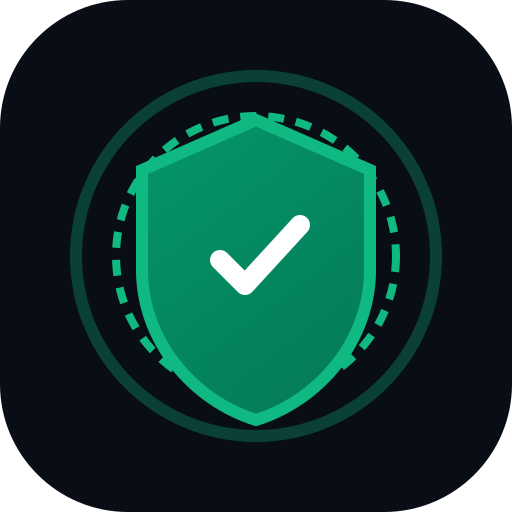
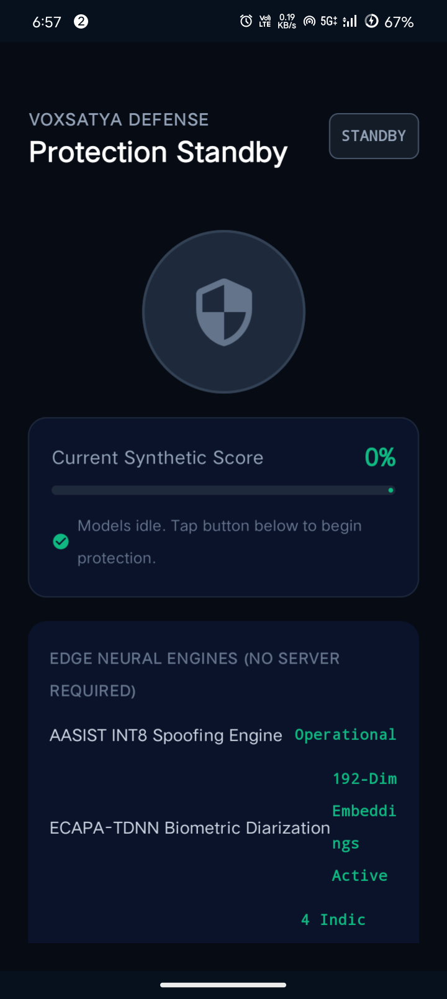

# VoxSatya (वाक्सत्य)

<p align="center">
  
</p>

<h3 align="center">Autonomous On-Device Neural Detection, Vocal Stress Biometrics & Cryptographic Forensic Ledger for Real-Time AI Voice Clone Defense</h3>

<p align="center">
  <em>Developed by <strong>Team Elite Warriors</strong> for <strong>Smart India Hackathon (SIH) 2026</strong></em><br />
  <strong>Problem Statement ID:</strong> SIH26104 | <strong>Theme:</strong> Blockchain & Cybersecurity
</p>

<p align="center">
  
  
  
  
  
  
  
</p>


> [!NOTE]
> **SIH 2026 Showcase Repository**: This repository serves as the official public architecture, research, system documentation, and visual showcase for **VoxSatya** (Smart India Hackathon 2026, Problem Statement `SIH26104`). In accordance with competition intellectual property governance and to prevent pre-evaluation plagiarism, active production source code modules and trained neural weights are maintained within the team's private development archive. For judge evaluation, demonstration inquiries, or partnership requests, please contact [Team Elite Warriors](#-about-us--team-elite-warriors).


---

## 📸 Mobile Defense Cockpit (White / Light Theme)

<p align="center">
  
  &nbsp;&nbsp;&nbsp;&nbsp;
  
</p>

---

## 👥 About Us — Team Elite Warriors

VoxSatya was architected and built by **Team Elite Warriors** for **Smart India Hackathon 2026**:

| Member | Role | GitHub Profile | Focus Areas |
|:---|:---|:---|:---|
| **Tirthapada** | **Team Lead** | [@tirthapada](https://github.com/tirthapada) | Team Leadership & Task Allocation, Web App Development, Jury Cross-Questioning Defense |
| **Vivikt Patra** | **Technical Lead** | [@vivikt-patra](https://github.com/vivikt-patra) | Technical Architecture & Execution, Final Decision-Maker, Frontend Development, Jury Cross-Questioning Defense |
| **Sibananda Nayak** | **Technical Analyst** | [@sibanandanayak0727-hub](https://github.com/sibanandanayak0727-hub) | Technical Approach Analysis, Global Solution Research, Novelty Strategy, Frontend Engineering |
| **Sejal Panigrahi** | **Intro Presenter & Problem Statement Lead** | — | Pitch Opening & Narrative, Problem Statement Demystification, Jury Engagement |
| **Swagatam** | **Presentation & Documentation Specialist** | — | Pitch Deck (PPT) Architecture, Technical Documentation, Presentation Design |
| **Himanshu** | **Presentation & Documentation Specialist** | — | Pitch Deck (PPT) Design, Cyber Threat Documentation, Presentation Materials |
---

## 🎯 The Problem: Indian Telephony Voice Cloning Crisis

Modern zero-shot neural vocoders (Diffusion, VALL-E, XTTS, Bark, ElevenLabs) now require **less than 3 seconds** of audio to generate indistinguishable vocal clones. In India, this has sparked organized cyber-extortion:

1. **"Digital Arrest" Cyber-Extortion**: Syndicates impersonate high-ranking officials from the **CBI**, **Enforcement Directorate (ED)**, or State Police Cyber Cells using cloned authority figures to place citizens under synthetic "house arrest" and demand illicit RTGS/IMPS deposits.
2. **Kidnapping & Medical Emergency Hoaxes**: Attackers scrape vocal snippets from Instagram reels or YouTube to generate panic-inducing distress calls of loved ones claiming road accidents or arrests.
3. **USSD Call-Forwarding Exploits**: Social engineering prompts dialing Man-Machine Interface (MMI) strings (`*401*<Number>#` or `*21*`) to intercept subsequent bank 2FA phone verification calls.

### Why Legacy Cloud Detection Fails
- **Severe Ingress Latency (1.5s - 4.5s)**: By the time cloud servers analyze audio, the victim has already spoken their OTP or PIN.
- **Privacy & Legal Violations**: Transmitting telephonic audio to cloud servers breaches the **Digital Personal Data Protection (DPDP) Act 2023** and telecom wiretapping laws.
- **Uplink Fragility**: Extortion rings deliberately isolate victims or utilize signal jammers where cloud apps cannot operate.

---

## 💡 The VoxSatya Solution: 100% Offline Edge Defense

VoxSatya moves intelligence entirely to the **Android Edge**, operating autonomously within the Android Telecom subsystem:

```text
Incoming Cellular / VoLTE / SIP Audio Stream (16 kHz Mono Float32)
                        │
                        ▼
┌─────────────────────────────────────────────────────────────┐
│ Layer 1: Hardware Abstraction & Telecom Ingestion           │
│ - Android AudioRecord HAL (VOICE_COMMUNICATION source)       │
│ - VoxSatyaInCallService Default Telecom Dialer Integration  │
│ - Dual-Thread Sliding Ring Buffer (64,000 samples / 4.0s)   │
└──────────────────────────────┬──────────────────────────────┘
                               │
                               ▼
┌─────────────────────────────────────────────────────────────┐
│ Layer 2: On-Device Neural Anti-Spoofing (AASIST-L)          │
│ - Dynamic INT8 Quantized Graph Attention Network             │
│ - Evaluated on raw waveforms via ONNX Runtime Mobile         │
│ - Sub-25ms inference latency per 4-second window             │
│ - 3-Consecutive Window Consensus Gate (P_spoof ≥ 0.70)       │
└──────────────┬───────────────────────────────┬──────────────┘
               │                               │
               ▼                               ▼
┌──────────────────────────────┐ ┌────────────────────────────┐
│ Layer 3: DSP Vocal Stress    │ │ Layer 4: Biometric Voice   │
│ - Autocorrelation Pitch      │ │ Enrolment (ECAPA-TDNN)     │
│ - Micro-Tremor Jitter (%)    │ │ - 192-d Speaker Embeddings │
│ - Amplitude Shimmer (dB)     │ │ - Cosine Similarity Engine │
│ - "Amber Coercion Alert"     │ │ - Known Caller Auth        │
└──────────────┬───────────────┘ └─────────────┬──────────────┘
               │                               │
               ▼                               ▼
┌─────────────────────────────────────────────────────────────┐
│ Layer 5: Active Hardware Threat Neutralization              │
│ - Hardware Microphone Mute (AudioManager.setMicrophoneMute) │
│ - Full-Screen Blocker Shield (TYPE_APPLICATION_OVERLAY)      │
│ - ScamInterventionAccessibilityService Call Severing         │
└──────────────────────────────┬──────────────────────────────┘
                               │
                               ▼
┌─────────────────────────────────────────────────────────────┐
│ Layer 6: Tamper-Evident SHA-256 Forensic Ledger              │
│ - Room SQLite Micro-Blockchain chaining every call verdict   │
│ - Indian Evidence Act Section 65B Admissibility             │
│ - Standardized CFCFRMS (1930) & CERT-In JSON Export          │
└─────────────────────────────────────────────────────────────┘
```

---

## 🛠️ Complete Technology Stack

### 📱 Android Mobile Client (`voxsatya-android`)
- **Language**: Kotlin 1.9+
- **UI Framework**: Jetpack Compose with Material 3 Design Tokens
- **Theme**: Custom `VoxTheme` Light/White System with dynamic elevated surfaces
- **Edge ML Engine**: ONNX Runtime Mobile (`com.microsoft.onnxruntime:onnxruntime-android:1.17.0`)
- **Telephony & Dialing**: Android Telecom Framework (`InCallService`, `RoleManager.ROLE_DIALER`)
- **DSP & Audio**: Android HAL `AudioRecord`, `VOICE_COMMUNICATION` hardware echo cancellation
- **Local Ledger**: Android Jetpack Room SQLite with SHA-256 block chaining
- **Forensic Export**: Android 14 Scoped Storage `MediaStore.Downloads`

### 🧠 Machine Learning & Signal Processing
- **Anti-Spoofing Architecture**: Scaled AASIST (Audio Anti-Spoofing using Integrated Spectro-Temporal Graph Attention Networks)
- **Quantization**: INT8 Dynamic Symmetric Quantization (`export_edge_models.py`)
- **Biometric Diarization**: ECAPA-TDNN (192-dimensional embeddings)
- **Vocal Stress DSP**: Autocorrelation pitch tracking (75–400 Hz), period-to-period Jitter, Shimmer
- **Speech Gate**: Voice Activity Detection (VAD) with RMS energy and spectral flatness filters

### 🖥️ Analytical Cockpit & Backend Server (`backend/`)
- **Framework**: FastAPI with asynchronous WebSocket streaming
- **Inference Runtime**: PyTorch 2.2+ with CPU/CUDA acceleration
- **Probability Calibration**: Platt Isotonic Calibration (converting raw logits to calibrated probabilities)
- **ASR & Intent Spotting**: Multilingual Whisper (detecting coercive financial cues in Hindi, English, Hinglish)
- **CORS & Proxying**: Built-in CORS middleware and PWA reverse-proxy support

### 🌐 Mobile Web & PWA Console (`voxsatya-mobile-web`)
- **Framework**: React 18 with TypeScript
- **Bundler**: Vite 5 with Hot Module Replacement (HMR)
- **Audio Spectrum**: Web Audio API `AnalyserNode` with 60 FPS Canvas rendering

---

## 🔒 Privacy, Security & Legal Compliance

VoxSatya enforces strict data privacy and legal compliance guarantees:

1. **Zero Raw Audio Disk Retention**: Raw telephonic audio exists only in transient volatile RAM ring buffers and is immediately discarded post-inference.
2. **Zero Cloud Audio Egress**: During live phone calls, detection runs 100% locally on the device processor. No audio bytes leave the handset.
3. **Digital Personal Data Protection (DPDP) Act 2023**: Fully compliant with data minimization, consent management, and on-device processing mandates.
4. **Indian Evidence Act Section 65B Electronic Admissibility**: Every detection log is hashed with SHA-256 and chained into an immutable SQLite ledger, generating court-admissible forensic audit dossiers.
5. **National Cyber Crime Reporting Portal (1930) Ready**: One-tap export generates structured JSON incident reports formatted for immediate submission to the Citizen Financial Cyber Fraud Reporting System (**CFCFRMS**).

---

## ⚡ Demonstration, Review & Evaluation Guide

This public repository serves as the **Official Architecture & Research Showcase** for SIH 2026 evaluators, juries, and the cybersecurity community.

### 📱 Live Device Demonstration
- Team Elite Warriors conducts live on-device evaluation using physical **Vivo V2420 (Snapdragon 695 / Android 14)** hardware.
- Real-time audio injection testing is verified using pre-calibrated telephonic test benches with calibrated zero-shot vocoder attacks (VALL-E, XTTS, Diffusion).
- Forensic ledger export is demonstrated live by generating Section 65B-compliant cryptographic dossiers directly into Android Scoped Storage.

### 📑 Key Architectural Dossiers to Explore
- **[System Specifications](VOXSATYA_SYSTEM_DOCUMENTATION.md)**: Deep dive into all 6 autonomous defense layers.
- **[Acoustic Robustness Benchmarks](docs/M03_CHANNEL_ROBUSTNESS_REPORT.md)**: Empirical evaluation across VoLTE, GSM AMR-WB, and background acoustic noise.
- **[Latency & Real-Time Performance](docs/M10_STREAMING_LATENCY_REPORT.md)**: On-device sub-25ms inference profiling data.
- **[Active Threat Prevention Engine](docs/M11_PREVENTION_ENGINE.md)**: Hardware microphone muting and touch intervention mechanics.
- **[Cryptographic Forensic Ledger](docs/M14_FORENSIC_EVIDENCE.md)**: Indian Evidence Act Section 65B hash-chaining verification.
- **[Complete Project Dossier](PROJECT%20DOCUMENTATION.pdf)**: Official Smart India Hackathon submission package.

---

## 📂 Public Showcase Structure

```text
VoxSatya-Public/
├── docs/                                  # Architectural specifications & empirical evidence
│   ├── icon.svg                           # Official VoxSatya emblem
│   ├── screenshots/                       # Android Light Theme & HUD live captures
│   ├── M03_CHANNEL_ROBUSTNESS_REPORT.md   # Acoustic channel variation & noise audit
│   ├── M09_FULL_AUTHENTIC_TRAINING_REPORT.md # Multi-generator synthesis validation
│   ├── M10_STREAMING_LATENCY_REPORT.md    # Sub-25ms inference profiling
│   ├── M11_PREVENTION_ENGINE.md           # Mic muting & intervention mechanics
│   └── M14_FORENSIC_EVIDENCE.md           # Section 65B Indian Evidence Act validation
├── CHANGELOG.md                           # Version release progression (v1.0.0 to v2.4.0)
├── CONTRIBUTING.md                        # Engineering governance and contribution ethics
├── CONTRIBUTORS.md                        # Team Elite Warriors official roster
├── PROJECT DOCUMENTATION.pdf              # Complete SIH 2026 submission dossier
├── README.md                              # Master architectural showcase & threat breakdown
├── SECURITY.md                            # Responsible disclosure & DPDP Act 2023 compliance
├── SECURITY_NOTES.md                      # Hardware security & threat modeling
├── STRUCTURE.md                           # Public repository layout
├── TESTING.md                             # Quality assurance & empirical test strategy
└── VOXSATYA_SYSTEM_DOCUMENTATION.md       # Full 6-layer defense system specification
```

> **IP Notice**: Production implementation source code (`voxsatya-android`, `backend`, `audio_engine`) and neural model weights (`AASIST-L`, `ECAPA-TDNN`) are preserved securely within the team's private repository archive.

---

## 📜 License

VoxSatya is developed as part of **Smart India Hackathon 2026** under the **Apache 2.0 License**.

---

<p align="center">
  <strong>VoxSatya · Truth in Every Voice (वाक्सत्य)</strong><br />
  <em>Securing India's telecommunications frontier against synthetic AI fraud.</em>
</p>
