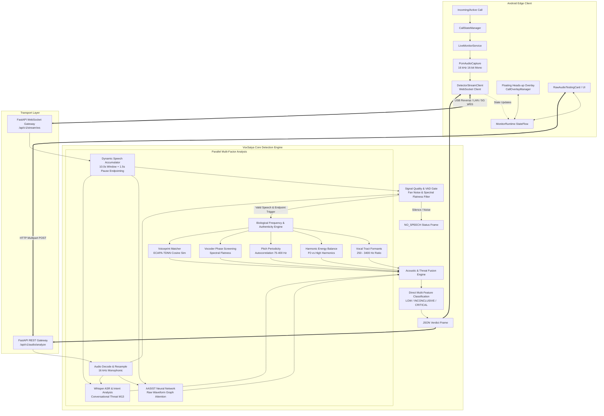
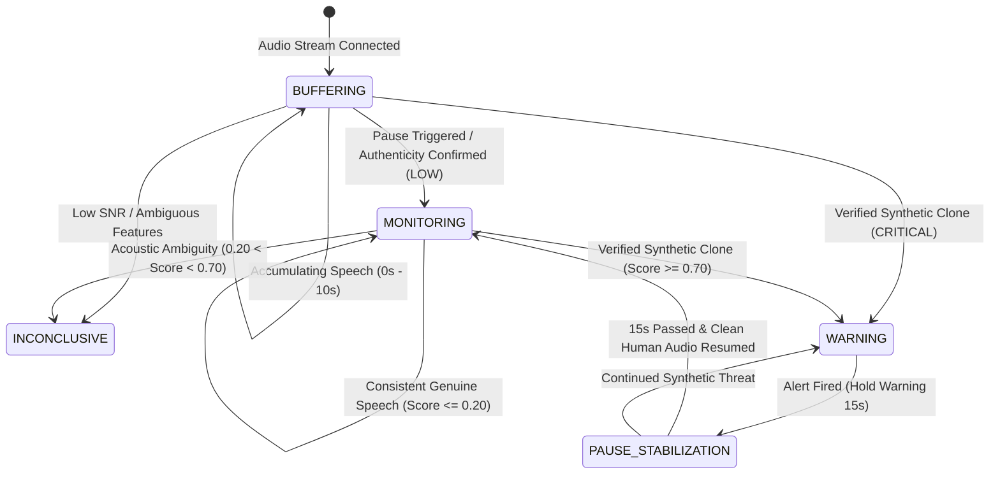

# System Architecture: VoxSatya

## 1. High-Level Architectural Overview

VoxSatya is designed as a distributed, edge-to-server multi-modal pipeline that analyzes acoustic, biological, neural, and linguistic features in parallel to achieve real-time voice clone defense without telecom carrier dependency.



---

## 2. Component Breakdown & Connections

### 2.1 Android Edge Client (`voxsatya-android`)
- **`CallStateManager`**:
  - Monitors telephony call states using Android's `TelephonyCallback` / `PhoneStateListener`.
  - Automatically triggers monitoring when a call transitions to `CALL_STATE_OFFHOOK` and terminates when `CALL_STATE_IDLE`.
- **`PcmAudioCapture`**:
  - Interfaces with Android's `AudioRecord` hardware HAL.
  - Automatically negotiates optimal audio sources (`MediaRecorder.AudioSource.VOICE_COMMUNICATION` $\rightarrow$ `MIC` $\rightarrow$ `DEFAULT`).
  - Streams raw 16-bit PCM chunks (3200 bytes = 100ms) at 16,000 Hz.
- **`DetectorStreamClient`**:
  - Manages resilient OkHttp WebSocket connections with automatic connection failover (`127.0.0.1` $\rightarrow$ LAN IP $\rightarrow$ Hotspot IP).
  - Handles ping/pong keep-alives and backpressure.
- **`MonitorRuntime` & `MonitorState`**:
  - Single source of truth using Kotlin `StateFlow<MonitorState>`.
  - Implements **Delta Guards** to prevent UI recomposition and flickering when streaming non-essential status updates.
- **`CallOverlayManager`**:
  - System window overlay rendered via `WindowManager.LayoutParams.TYPE_APPLICATION_OVERLAY`.
  - Displays interactive, draggable threat pill directly over the native in-call dialer.

---

### 2.2 Transport & Ingestion Layer
- **Protocol**: Raw binary frames over WebSocket for streaming PCM audio; JSON text frames for bidirectional control and detection results.
- **Buffer Management & Pause Endpointing (`StreamSession`)**:
  - Speech accumulator holding up to 160,000 samples (10.0 seconds).
  - **Dynamic Pause Endpointing**: Detects speech completion when the speaker speaks $\ge 2.5\text{s}$ followed by a pause of $\ge 1.5\text{s}$.
  - **Trailing Noise Slicing**: Automatically cuts off trailing pause and fan noise so only pure speech is evaluated.
  - **Max Window Fallback**: If speech continues unbroken, triggers automatically at 10.0 seconds.
  - **Automatic Silence Reset**: If no audio is received for $> 3.0$ seconds, the session resets to prevent stale audio contamination.

---

### 2.3 Layer 1: Signal Quality & Voice Activity Detection (VAD) Gate
Every audio window is first inspected by the Signal Quality Gate to eliminate false alarms caused by empty audio:
- **RMS Energy Threshold**: Requires $\text{RMS} \ge 0.008$ to reject pure silence.
- **Chunk-Level Spectral Flatness Gating**: Normal human speech has low spectral flatness ($\text{SF} < 0.60$), whereas fan noise has high spectral flatness ($\approx 1.0$). Fan hum is rejected at the chunk level.
- **Effective Bandwidth**: Verifies spectral energy exists up to at least $1000\text{ Hz}$.
- **Clipping Ratio**: Ensures audio distortion does not exceed $5\%$ saturation.

If the audio fails the VAD gate, the backend immediately emits a `NO_SPEECH` frame without wasting GPU/CPU compute on downstream neural networks.

---

### 2.4 Layer 2: Biological Frequency & Authenticity Engine (`audio_engine/authenticity.py`)
This engine extracts physiological invariants of the human vocal tract that AI voice generators struggle to replicate:

```
[Clean Speech Signal: 2.5s - 10.0s]
  ├── Bandpass Filter [250 Hz - 3400 Hz] ───> Energy Ratio vs Full Spectrum (> 0.55 = Human Formant Concentration)
  ├── Autocorrelation Lag [75 Hz - 400 Hz] ──> Maximum Peak Height (> 0.30 = Natural Vocal Cord Pitch Periodicity)
  ├── Harmonic Peak Slicing (H1 - H5) ──────> Harmonics-to-Noise Ratio (0.15 - 9.50 = Balanced Glottal Pulse)
  ├── Spectral Flatness & Phase Variance ───> Vocoder Artifact Score (< 0.35 = Absence of Neural Vocoder)
  └── ECAPA-TDNN 192-dim Embedding ─────────> Cosine Similarity vs Enrolled Voiceprint (>= 0.72 = Verified Identity)
```

- **Vocal Tract Formant Energy Ratio**: Human speech organs (pharynx, oral cavity, nasal cavity) form resonant bandpass filters (formants $F_1, F_2, F_3$) within $250 - 3400\text{ Hz}$. Synthetic audio often exhibits energy leakage above $4000\text{ Hz}$ or flat artificial spectra.
- **Harmonic Balance Ratio**: Natural vocal fold vibration produces exponentially decaying harmonic peaks. Synthetic speech models frequently display irregular harmonic peaks or phase discontinuities between adjacent harmonics.
- **Pitch Periodicity ($F_0$)**: Measures autocorrelation lag peaks corresponding to human glottal cycle lengths ($2.5\text{ ms} - 13.3\text{ ms}$).

---

### 2.5 Layer 3: Spectro-Temporal Neural Network (AASIST)
- **Model**: Audio Anti-Spoofing using Integrated Spectro-Temporal Graph Attention Networks.
- **Representation**: Raw waveform input $\rightarrow$ SincNet sinc-convolutional filters $\rightarrow$ Spectro-Temporal Graph Attention $\rightarrow$ Graph pooling $\rightarrow$ 2-class softmax output (Spoof vs Bonafide).
- **Calibration Engine**:
  - Raw neural logits trained on studio datasets are shifted by mobile phone channel distortion.
  - Temperature scaling ($T = 1.85$) and empirical Platt calibration map raw model logits into a true posterior spoof probability $P(\text{Synthetic} \mid \mathbf{x})$.

---

### 2.6 Layer 4: Multimodal Conversational Scam Intelligence (M13)
- **ASR Engine**: Automated Speech Recognition running Whisper (`whisper-tiny` / `whisper-base`) with chunked inference.
- **Threat Intent Classification**: Evaluates transcripts for social engineering attack vectors:
  - **Financial Coercion**: Demands for UPI transfers, bank account numbers, cryptocurrency.
  - **Digital Arrest Extortion**: Impersonation of CBI, Customs, Cyber Crime Police, National Crime Records Bureau.
  - **Urgency & Panic Inducers**: Threats of immediate arrest, disconnection of electricity, freezing of bank accounts.
  - **Credential Theft**: Requests for 6-digit OTP, netbanking passwords, debit card CVV.

---

### 2.7 Layer 5: Fusion Decision Matrix & State Machine



#### Decision Rules:
1. **LOW Risk (`GENUINE`)**:
   - `calibrated_spoof_prob <= 0.20` **OR** `biological_formants_verified == True`.
   - Result: Green indicator, authentic human voice confirmed. Reset critical counter to 0.
2. **INCONCLUSIVE Risk**:
   - `0.20 < calibrated_spoof_prob < 0.70` **OR** degraded SNR ($< 12\text{ dB}$).
   - Result: Amber indicator, collecting further speech data.
3. **CRITICAL Risk (`SYNTHETIC`)**:
   - `calibrated_spoof_prob >= 0.70` **AND** `vocoder_artifacts_detected == True`.
   - Result: Instant red alert banner, haptic vibration pulse, actionable anti-fraud advisory, and 15s stabilization hold.
